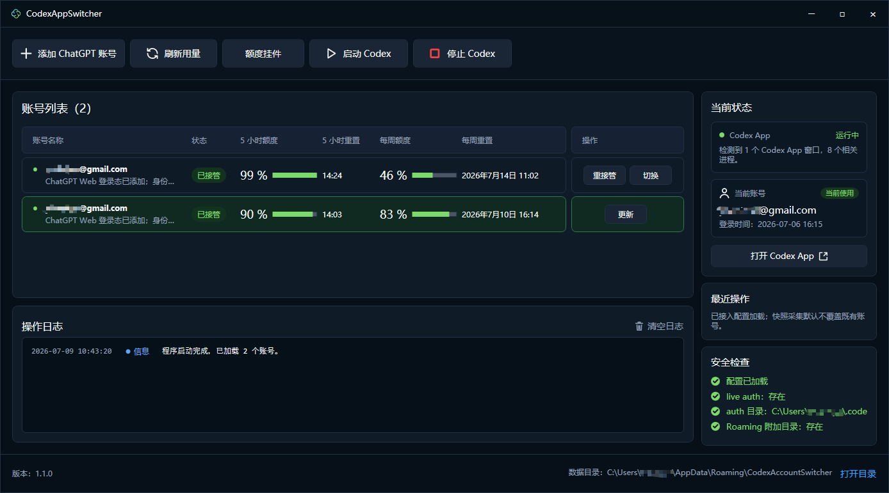
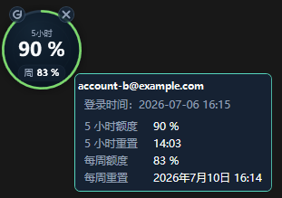
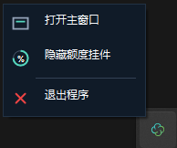

# CodexAppSwitcher

CodexAppSwitcher 是一个 Windows 本机工具，用于管理多个 Codex App 账号的登录态快照，并在账号之间切换。

当前版本：`v1.1.0`

当前版本采用固定策略：关闭 Codex App，写入目标账号的 `%USERPROFILE%\.codex\auth.json`，再自动启动 Codex App。工具不处理 token、不替换 Roaming/MSIX 状态，也不隔离历史会话。

## 界面预览

以下截图已对账号邮箱和本机路径做脱敏处理。

主窗口工作台：



桌面额度悬浮球：



托盘右键菜单：



## 适用场景

- 本机需要在多个 Codex App 账号之间切换。
- 每个账号都已能在 Codex App 中正常登录。
- 希望通过工具保存各账号的 auth 快照，后续一键切换。

不适用于：

- 已失效、已撤销或需要重新登录的 auth。
- 需要隔离 `.codex\sessions` 对话历史的场景。
- 需要刷新 token、导出 cookie 或迁移账号凭据的场景。

## 核心行为

- 添加账号：保存 ChatGPT Web 登录目录和账号元数据。
- 接管账号：把当前 Codex App 的 live `auth.json` 采集为目标账号快照。
- 更新账号：用当前 Codex App 登录态覆盖该账号已有快照。
- 切换账号：关闭 Codex App，写入目标账号 auth，然后自动启动 Codex App。
- 删除账号：只删除 Switcher 本地账号数据，不删除线上账号。

## 使用流程

1. 点击 `添加 ChatGPT 账号`。
2. 在弹窗中登录 ChatGPT。
3. 自动识别或手动填写账号 ID 后，点击 `使用当前账号`。
4. 在 Codex App 中确认已登录同一个账号。
5. 回到 Switcher，对该账号点击 `接管`，再点击 `完成`。
6. 对其他账号重复以上步骤。
7. 切换时点击目标账号行的 `切换`。

切换成功后，Codex App 会自动重新启动。账号是否真正生效，以 Codex App 重新启动后的账号菜单和个人资料页为准。

## 功能清单

- 添加 ChatGPT Web 账号。
- 重复账号覆盖确认。
- 接管和更新 Codex App auth 快照。
- 一键切换已接管账号。
- 切换后自动启动 Codex App。
- 启动、停止 Codex App。
- 刷新账号用量。
- 桌面额度悬浮球，支持手动刷新当前账号用量。
- 托盘后台状态图标，关闭主窗口后仍可恢复或退出。
- 账号重命名。
- 打开 App 快照目录。
- 打开 Web 登录目录。
- 删除非当前本地账号。
- 查看当前账号、Codex App 状态、安全检查和最近操作。
- 清空操作日志。
- 打开 Switcher 数据目录。

## 安全边界

- 工具只写 `%USERPROFILE%\.codex\auth.json`。
- 写入 auth 前会先关闭 Codex App，避免运行中状态覆盖失败。
- 不展示、不解密、不导出 token、cookie 或密码。
- 不刷新 token。
- 不创建 rollback。
- 不替换 `%APPDATA%\Codex` Roaming 目录。
- 不替换 MSIX 包状态。
- 不提供模拟切换或模式选择。
- 不切换 `.codex\sessions`。

## 本地数据

默认数据目录：

```text
%APPDATA%\CodexAccountSwitcher
```

该目录保存账号元数据、WebView2 登录目录和 Codex App auth 快照。删除本地账号会删除对应本地目录，但不会影响线上账号。

## 构建

主项目：

```powershell
dotnet build CodexAppSwitcher\CodexAppSwitcher.csproj -c Debug -v minimal
```

测试项目：

```powershell
dotnet build CodexAppSwitcher.Tests\CodexAppSwitcher.Tests.csproj -c Debug -v minimal
dotnet CodexAppSwitcher.Tests\bin\Debug\net8.0-windows\CodexAppSwitcher.Tests.dll
```

不要把运行或测试输出改到 `.tmp`。如果构建提示文件被占用，先关闭正在运行的 Switcher，再重新构建。

## 验证建议

真实登录态相关功能需要在本机通过 VS2022 或 Debug 产物手动验证。建议至少覆盖：

- 添加一个新账号。
- 接管当前 Codex App 账号。
- 更新当前账号快照。
- 在两个已接管账号之间切换。
- 确认切换后 Codex App 自动重启。
- 打开 Codex App 账号菜单和个人资料页，确认账号加载正常。
- 关闭主窗口后，通过托盘图标恢复主窗口或退出程序。
- 打开桌面额度悬浮球，确认用量显示和手动刷新可用。

## 常见问题

### 切换后 Codex App 还是旧账号

优先确认目标账号已经完成接管，并且切换时 Codex App 被工具关闭后重新启动。当前工具只写 live `auth.json`，不会修复已失效的 auth。

### 切换后个人资料无法加载

通常说明目标账号 auth 已失效或服务端要求重新登录。需要在 Codex App 中重新登录该账号，然后回到 Switcher 更新账号快照。

### 删除本地账号会删除线上账号吗

不会。删除只影响 Switcher 本地保存的元数据、Web 登录目录和 App 快照目录。
