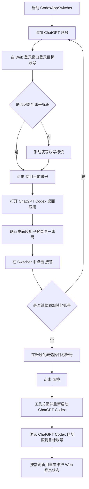

# CodexAppSwitcher

CodexAppSwitcher 是一款面向 Windows 的 ChatGPT Codex 账号切换工具，用于在本机保存多个账号的 Codex App 登录快照，并提供账号切换、用量查看、状态检查和后台托盘管理能力。

当前版本：`v1.1.1`

## 功能特性

- 多账号管理：添加、识别、重命名、删除本地账号。
- 账号切换：在已接管的 Codex App 账号之间一键切换。
- 登录快照：为每个账号保存独立的 Codex App auth 快照。
- 快照更新：使用当前 Codex App 登录态更新指定账号快照。
- 用量刷新：读取 ChatGPT Codex 5 小时额度、每周额度和重置时间。
- 单账号刷新：可只刷新某一个账号的用量数据。
- Web 登录维护：可重新打开指定账号的 ChatGPT Web 登录窗口。
- 桌面额度挂件：显示当前账号额度状态，并支持快速刷新。
- 托盘后台运行：关闭主窗口后仍可从托盘恢复或退出。
- 安全检查：展示配置、live auth、auth 目录和可选 Roaming 目录状态。
- 操作日志：记录账号切换、用量刷新、启动停止和异常信息。

## 系统要求

- Windows 11
- .NET 8 Desktop Runtime
- Microsoft Edge WebView2 Runtime
- 已安装并可正常打开 ChatGPT Codex 桌面应用

## 界面预览

主窗口工作台：


桌面额度悬浮球：


托盘右键菜单：


## 快速开始

1. 启动 `CodexAppSwitcher.exe`。
2. 点击 `添加 ChatGPT 账号`，完成第一个账号的 Web 登录。
3. 在 ChatGPT Codex 桌面应用中登录同一个账号。
4. 回到 Switcher，对该账号点击 `接管`，保存 Codex App 登录快照。
5. 对其他账号重复添加和接管流程。
6. 需要切换账号时，在目标账号行点击 `切换`。

切换完成后，ChatGPT Codex 会自动重新启动。请以 ChatGPT Codex 账号菜单或个人资料页显示的账号为准。

## 操作流程图



## 账号添加流程

### 1. 添加 ChatGPT Web 账号

1. 在主窗口点击 `添加 ChatGPT 账号`。
2. 弹出的 Web 登录窗口会打开 ChatGPT 页面。
3. 登录需要加入 Switcher 的 ChatGPT 账号。
4. 等待工具自动识别账号邮箱或账号 ID。
5. 如未自动识别，可在手动输入框中填写账号标识。
6. 点击 `使用当前账号`。

添加完成后，工具会为该账号创建独立的 WebView2 登录目录。该目录用于后续刷新用量和维护 Web 登录状态。

### 2. 接管 Codex App 登录态

添加 Web 账号后，还需要为该账号保存 Codex App 登录快照。

1. 打开 ChatGPT Codex 桌面应用。
2. 在 ChatGPT Codex 中确认当前登录的是刚添加的账号。
3. 回到 Switcher，在该账号行点击 `接管`。
4. 按提示确认接管操作。
5. 接管完成后，该账号即可用于切换。

如果账号行仍显示未接管，请确认 ChatGPT Codex 已登录对应账号，然后重新执行接管。

### 3. 添加多个账号

为每个账号依次执行：

1. `添加 ChatGPT 账号`
2. 在 Web 登录窗口登录该账号
3. 在 ChatGPT Codex 桌面应用登录同一账号
4. 在 Switcher 中点击该账号的 `接管`

建议先完成一个账号的添加、接管和切换验证，再继续添加下一个账号。

## 账号管理

### 切换账号

1. 在账号列表中找到目标账号。
2. 点击该账号行的 `切换`。
3. 工具会关闭 ChatGPT Codex，写入目标账号快照，并重新启动 ChatGPT Codex。
4. 打开 ChatGPT Codex 账号菜单，确认已切换到目标账号。

切换过程中请不要手动编辑 `.codex` 目录或同时启动多个 ChatGPT Codex 实例。

### 更新账号快照

当 ChatGPT Codex 要求重新登录，或某个账号切换后无法正常加载个人资料时，需要更新账号快照。

1. 在 ChatGPT Codex 中重新登录目标账号。
2. 回到 Switcher，找到对应账号。
3. 点击该账号行的 `更新` 或按当前界面提示完成快照更新。
4. 更新后再次执行切换验证。

### 重新接管账号

如果账号快照与当前 Codex App 登录态不一致，可重新执行接管流程。

1. 确认 ChatGPT Codex 当前登录的是目标账号。
2. 在 Switcher 中选择该账号。
3. 点击 `接管`。
4. 按提示确认覆盖该账号的本地快照。

### 刷新账号用量

- 点击顶部 `刷新用量` 可刷新所有账号。
- 点击账号行的 `用量` 可只刷新该账号。
- 桌面额度挂件可刷新当前使用账号。

用量数据来自 ChatGPT Codex 的使用情况接口，包含 5 小时额度、每周额度和对应重置时间。

### 维护 Web 登录状态

如果某个账号用量刷新失败，或日志提示 Web 会话未授权：

1. 点击该账号行的 `Web`。
2. 在弹出的 Web 登录窗口中重新登录 ChatGPT。
3. 点击 `使用当前账号`。
4. 回到主窗口后再次点击 `用量`。

### 重命名账号

1. 在账号行打开账号操作菜单。
2. 选择 `重命名`。
3. 输入新的显示名称并确认。

重命名只影响 Switcher 本地显示名称，不会修改线上 ChatGPT 账号信息。

### 打开本地目录

账号操作菜单提供以下目录入口：

- `打开 App 快照目录`：查看该账号保存的 Codex App auth 快照。
- `打开 Web 登录目录`：查看该账号独立的 WebView2 登录目录。
- 底部 `打开目录`：打开 Switcher 数据目录。

### 删除账号

1. 在账号行打开账号操作菜单。
2. 选择 `删除`。
3. 阅读提示并确认。

删除只移除 Switcher 本地保存的账号元数据、Web 登录目录和 App 快照目录，不会删除线上 ChatGPT 账号。当前正在使用的账号不可直接删除。

## 用量显示

账号列表和桌面额度挂件会显示：

- 5 小时剩余额度
- 5 小时重置时间
- 每周剩余额度
- 每周重置时间
- 可用的额度重置次数或剩余额度信息

如果重置时间在账号列表中显示不完整，可将鼠标悬停在时间文本上查看完整内容。

## 本地数据

默认数据目录：

```text
%APPDATA%\CodexAccountSwitcher
```

主要数据包括：

- 账号元数据
- 每个账号的 WebView2 登录目录
- 每个账号的 Codex App auth 快照
- 本地用量缓存

## 安全说明

- 所有账号数据均保存在本机。
- 工具不会上传账号快照、cookie、token 或密码。
- 用量刷新只在 WebView2 页面上下文中临时使用 ChatGPT 前端会话授权。
- 删除本地账号不会影响线上 ChatGPT 账号。
- 工具不会修改 ChatGPT Codex 的历史会话目录。

## 构建

主项目：

```powershell
dotnet build CodexAppSwitcher\CodexAppSwitcher.csproj -c Debug -v minimal
```

测试项目：

```powershell
dotnet build CodexAppSwitcher.Tests\CodexAppSwitcher.Tests.csproj -c Debug -v minimal
dotnet CodexAppSwitcher.Tests\bin\Debug\net8.0-windows\CodexAppSwitcher.Tests.dll
```

发布：

```powershell
dotnet publish CodexAppSwitcher\CodexAppSwitcher.csproj -p:PublishProfile=FolderProfile -v minimal
```

发布产物位于：

```text
CodexAppSwitcher\bin\Release\net8.0-windows\publish\win-x64
```

## 常见问题

### 切换后 ChatGPT Codex 仍显示旧账号

请确认目标账号已经完成接管。若账号已接管但仍未生效，请关闭 ChatGPT Codex 后重新执行切换。

### 切换后个人资料无法加载

通常表示该账号的 Codex App 登录快照已失效。请在 ChatGPT Codex 中重新登录该账号，然后回到 Switcher 更新账号快照。

### 用量刷新返回 401

点击该账号行的 `Web`，重新登录 ChatGPT Web 后再次刷新用量。如果仍失败，请查看操作日志中的 HTTP 状态、session 状态和响应预览。

### 添加账号时无法识别账号 ID

可以在添加账号窗口中手动输入账号邮箱或其他便于区分的账号标识，然后点击 `使用当前账号`。

### 删除本地账号会影响线上账号吗

不会。删除操作只影响本机 Switcher 数据，不会删除或修改线上 ChatGPT 账号。
